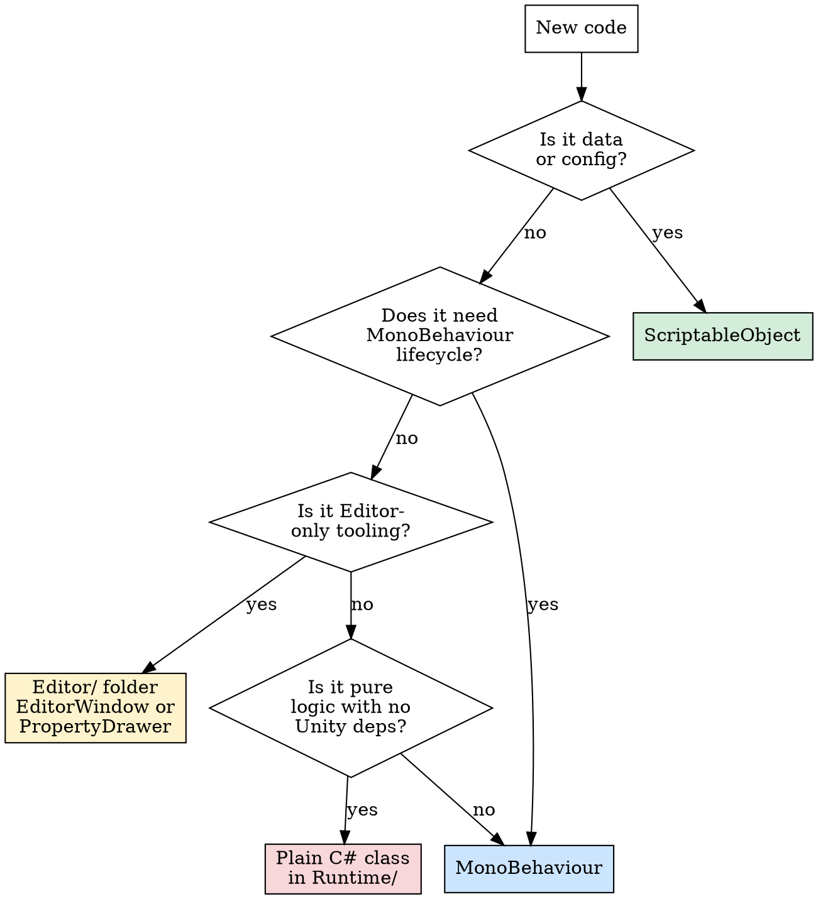
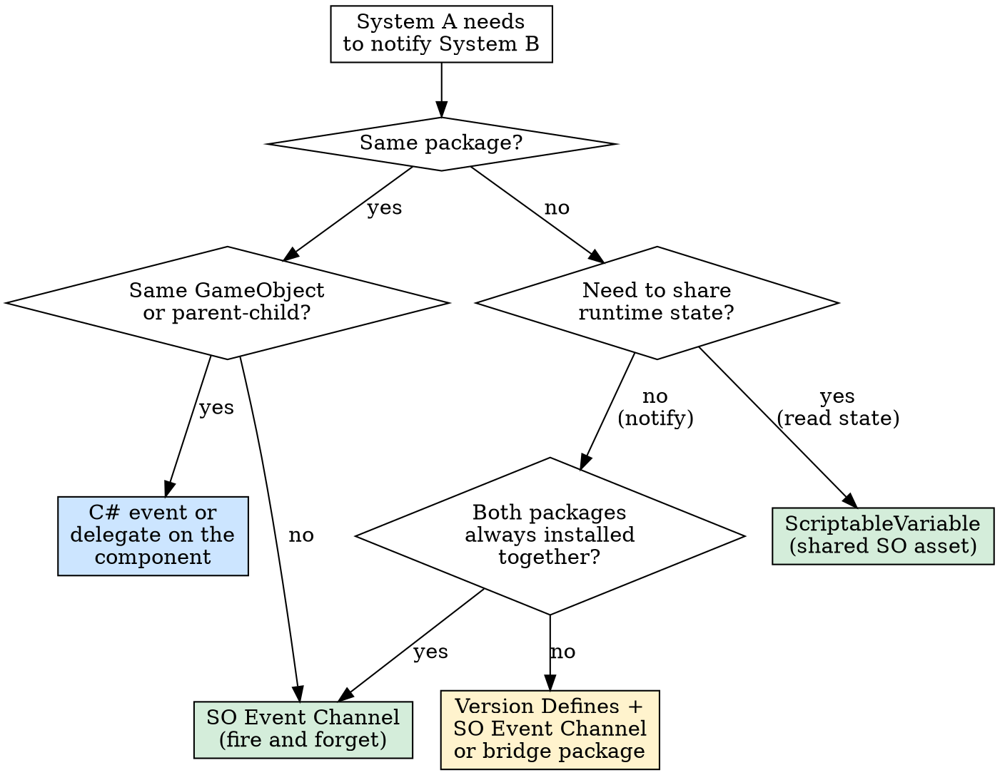

# Unity Reusable Systems

Build every gameplay system as a self-contained UPM package. Data lives in
ScriptableObjects, behavior lives in small single-responsibility MonoBehaviours,
and systems talk through SO Event Channels — never direct references.

Target: Unity 6+ / C# 11.

## The Rules

| ALWAYS | NEVER |
|--------|-------|
| One system = one UPM package | Create a "shared contracts" package with interfaces |
| Data in ScriptableObjects, behavior in MonoBehaviours | Put data and behavior in the same class |
| SO Event Channels for cross-system communication | Use singletons, service locators, or static managers |
| One assembly definition per folder (Runtime, Editor, Tests) | Ship without assembly definitions |
| Version Defines for optional cross-package awareness | Use `#if` defines without versionDefines in asmdef |
| Define Constraints for conditional integration assemblies | Create hard dependencies between gameplay packages |
| Small MonoBehaviours with `[RequireComponent]` | God classes that handle input + logic + rendering |
| ScriptableVariable for shared runtime state | Public static fields or global state holders |
| RuntimeSet for tracking active instances | FindObjectsOfType or singleton registries |
| `Awaitable` with `destroyCancellationToken` for async | Coroutines for new async work |
| `[SerializeReference]` for polymorphic serialized data | Deep inheritance hierarchies |
| Composition: many small components on one GameObject | One MonoBehaviour doing everything |
| Interfaces only at package boundaries when SO Events can't solve it | Interfaces inside a single package |
| Tests using ScriptableObject.CreateInstance in Edit Mode | Skipping tests because "it's just a SO" |

## Decision Flowchart: Where Does This Code Belong?

## Decision Flowchart: How Should These Systems Talk?

## New Package Checklist

Before shipping any package, verify:

- [ ] `package.json` with correct `name`, `version`, `unity` (6000.0+), `displayName`
- [ ] `Runtime/` with `{Company}.{Package}.asmdef` — zero external references
- [ ] `Editor/` with Editor-only asmdef (if any editor code exists)
- [ ] `Tests/Editor/` with test asmdef using `overrideReferences` and `testAssemblies`
- [ ] `Samples~/` with at least one importable sample
- [ ] `CHANGELOG.md` following SemVer
- [ ] All SOs have `[CreateAssetMenu]` with organized menu paths
- [ ] All MonoBehaviours use `[RequireComponent]` where applicable
- [ ] SO Event Channels for every output event (no direct subscriber lists)
- [ ] ScriptableVariables for any shared runtime state
- [ ] RuntimeSets for any "all active X" queries
- [ ] Version Defines in asmdef for any optional package awareness
- [ ] No `FindObjectsOfType`, no singletons, no static mutable state

## System Pattern Quick Reference

| System | SO Config | SO Event Channels | ScriptableVariable | RuntimeSet | Bridge Pattern |
|--------|-----------|-------------------|--------------------|------------|----------------|
| Inventory | ItemDefinition, SlotConfig | OnItemAdded, OnItemRemoved | CurrentWeight, SlotCount | ActiveInventories | Version Defines to shop/crafting |
| Combat | WeaponData, AttackConfig | OnHitDealt, OnHitReceived | — | ActiveCombatants | SO Event to health system |
| Health | HealthConfig, ResistanceProfile | OnDamaged, OnHealed, OnDied | CurrentHP | ActiveHealthComponents | Listens to combat's SO Events |
| Dialogue | DialogueTree, NodeData | OnDialogueStarted, OnChoiceMade | CurrentDialogue | — | Version Defines to quest system |
| Save/Load | SaveConfig | OnSaveRequested, OnLoadComplete | — | SaveableEntities | Each system implements ISaveable |
| Quest | QuestDefinition, ObjectiveData | OnQuestStarted, OnObjectiveComplete | ActiveQuest | ActiveQuests | Listens to dialogue/combat events |
| AI | BehaviorTreeData, StateConfig | OnStateChanged | CurrentTarget | ActiveAIAgents | Version Defines to combat/nav |

## Reference Files

Load these as needed — they contain code snippets and detailed patterns:

- **[references/package-structure.md](references/package-structure.md)** — UPM directory layout, asmdef setup, Version Defines, Define Constraints, SemVer rules, distribution
- **[references/so-architecture.md](references/so-architecture.md)** — ScriptableVariable, SO Event Channel, GameEventListener, RuntimeSet code patterns
- **[references/patterns.md](references/patterns.md)** — Component composition, cross-package integration, bridge packages, SerializeReference, Awaitable async, system decomposition
- **[references/testing.md](references/testing.md)** — Test asmdef setup, SO test patterns, event test patterns, Edit vs Play Mode guidance
